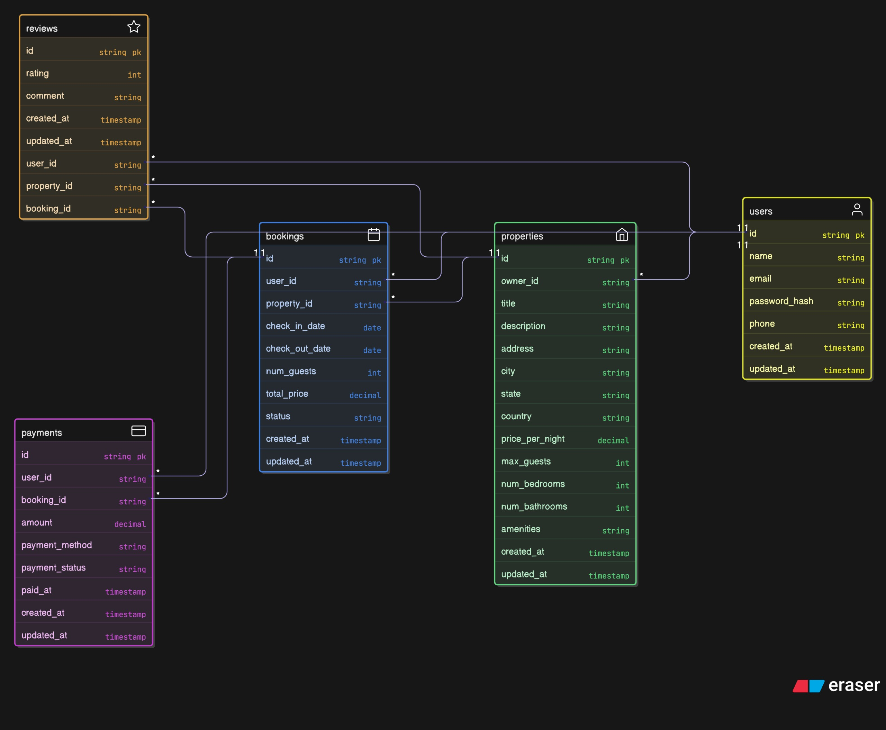

# AIRBNB Clone Project

## 🚀 Objective

This project is a mimic of the popular Airbnb website. The backend is designed to provide a robust and scalable solution for managing listings, bookings, and user interactions. It includes features such as user authentication, listing creation and management, booking management, and payment processing.

### ⚙️ Technology Stack

- Python (programming language)
- Django REST Framework (framework for building web APIs)
- GraphQL (query language for APIs in a structured format for data retrieval and manipulation)
- PostgreSQL (robust database management system that can handle large volumes of data and provide high performance)
- Redis (in-memory data structure store used as a database, cache, and message broker)
- Celery (distributed task queue used to process background tasks, can be used to process payments and notifications)
- Docker (containerization platform )

### 🛠️ Database Design

We have five tables in our database:

- Users

  To manage user information, authentication, and authorization. We will also manage user preferences and settings. Details about the user shall also be stored: name, email, phone number, address, profile picture, etc.

- Properties

  To manage property information, including details such as location, amenities, pricing, and availability. We will also manage property preferences and settings. Details about the property shall also be stored: name, description, address, photos, etc.

- Bookings

  To manage the specific booking details, including check-in and check-out dates, guest information, and payment status.

- Payments

  The payment requests processed, done using payment methods such as credit card, PayPal, or bank transfer. We also see the users and the amount they paid.

- Reviews

  Very important for the user experience and reputation management. We will manage reviews, ratings, and feedback from guests. Details about the review shall also be stored: title, content, rating, date, etc.

You can have a close look at the entity diagram below:



### ⏳ Feature Breakdown

1. API Documentation

   OpenAPI Standard: The backend APIs are documented using the OpenAPI standard to ensure clarity and ease of integration.

2. User Authentication

```bash
users/: /users/{user_id}/
```

Manage user sessions, including login, logout, and session management. Implement user roles and permissions for secure access control.

3. Property Management

```bash
  properties/: /properties/{property_id}/
```

Let users create, update, retrieve, and delete property listings. Implement property search and filtering features. Also properties are listings that would be users to use properties can book them.

4. Booking System

```bash
bookings/: /bookings/{booking_id}/
```

Manage bookings, including creating, updating, and canceling bookings. Implement booking status tracking and notifications. Let users view their bookings and cancel them.

5. Payment Processing

```bash
payments/: /payments/
```

Handle payment transactions related to bookings. We will have payment gateways to allow users to pay for their bookings securely using various payment methods.

6. Review System

```bash
reviews/: /reviews/{review_id}/
```

Having a feedback system to collect user feedback and ratings for properties. We will have notifications to notify users about new reviews and ratings.

7. Database Optimizations

   Indexing: Implement indexes for fast retrieval of frequently accessed data.
   Caching: cache property listings and user sessions, rate limits.

### 🔐API Security

We shall incorporate security measures such as authentication, authorization and rate limiting to ensure the security of our API.

To protect users' data we shall store hashes passwords and encrypt sensitive information such as credit card details.

### 📈 CI/CD

CI/CD pipelines are important in automating the build, test, and deployment process of our application. This ensures that our application is always up-to-date and free from bugs.

#### Here are some key tools that could be used:

CI/CD Orchestration Platforms: (These are the core engines that run your pipelines)

GitHub Actions: Integrated directly into GitHub repositories, great for projects already on GitHub.

GitLab CI/CD: Built into GitLab, offering a comprehensive all-in-one solution for Git, CI/CD, and more.

Jenkins: A powerful, highly customizable open-source automation server (often self-hosted).

Version Control System: Github in our case.

#### 💯 Team Roles

1. Backend Developer - Responsible for handling business logic, API design, and database interactions.
2. Database Administrator - Responsible for managing the database schema, optimizing queries, and ensuring data integrity.
3. Frontend Developer - Responsible for building the user interface, implementing user interactions, and integrating with the backend API.
4. Devops Engineer - Responsible for managing the deployment and infrastructure of the application.
5. QA Engineer - Responsible for testing the application, identifying bugs, and ensuring quality.
6. UX/UI Designer - Responsible for designing the user interface, creating wireframes, and ensuring a seamless user experience.
